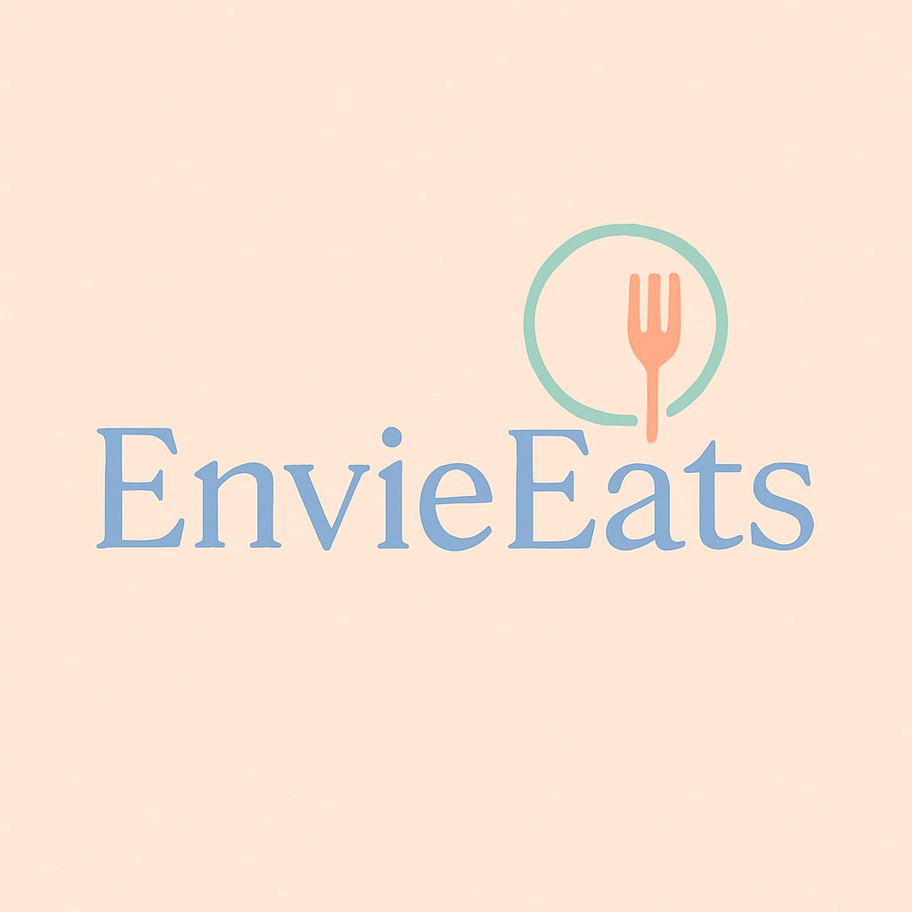

<p align="center">
  
</p>

<h1 align="center">EnvieEats 🍽️</h1>
<p align="center">A minimal and elegant food discovery app built with React + Parcel</p>

---

💼 EnvieEats – React-Based Food Discovery Web App
Tech Stack: React, Parcel, JavaScript (ES6+), Express.js, Node.js, Render, Vercel

Live Demo: https://envie-eats.vercel.app/

🧠 Project Description for Resume
Built EnvieEats, a responsive food discovery platform inspired by Swiggy, that fetches live restaurant and menu data from Swiggy’s public API. Tackled CORS restrictions by setting up a Node.js + Express proxy backend hosted on Render, enabling secure and seamless data access in the frontend.

🔧 Key Features & Highlights
⚡ Shimmer UI (Skeleton Screens): Custom shimmer loader implemented to enhance UX during data fetch, giving a modern app-like feel.

🔄 Dynamic Routing: Used React Router to handle dynamic routes like /restaurants/:id and fetch detailed menu pages.

🌐 Real-time Data Fetching: Used async/await with the fetch API to dynamically load restaurants and menus with loading states.

⚙️ CORS Bypass via Proxy: Developed a secure Express-based backend proxy that forwards Swiggy API requests to bypass browser CORS limitations.

♻️ Reusable Custom Hooks: Built useRestaurantMenu and other custom React hooks to encapsulate API logic and promote DRY principles.

🎛️ Accordions for Menu Sections: Implemented collapsible accordions for food categories with toggle logic using useState.

🌍 Deployed Fullstack App:

Frontend: React + Parcel hosted on Vercel

Backend: Express proxy server deployed on Render

🖼️ Image Optimization: Swiggy images lazy-loaded with dynamic URLs for performance.

🔍 Search & Filter: Built client-side filtering by restaurant name, cuisine, and top ratings using functional array methods.

## 📁 Folder Structure

```
EnvieEats/
├── src/
│   ├── components/
│   │   ├── Body.jsx
│   │   ├── Header.jsx
│   │   ├── Footer.jsx
│   │   ├── About.jsx
│   │   ├── Contact.jsx
│   │   ├── Error.jsx
│   │   ├── GroceryComponent.jsx
│   │   ├── RestaurantCard.jsx
│   │   ├── RestaurantMenu.jsx
│   │   ├── Shimmer.jsx
│   ├── utils/
│   │   └── useOnlineStatus.js
│   ├── App.jsx
│   └── app.js
├── public/
│   └── index.html
├── images/
│   └── envieeats-logo.png
├── style.css & other .css files
├── package.json
├── README.md
```

---

## ⚙️ Installation & Run

```bash
# Clone repo
git clone https://github.com/yourusername/envieeats.git
cd envieeats

# Install dependencies
npm install

# Start local dev server
npm start
```

> Parcel will run your app at `http://localhost:1234`

---

## 🌈 Tech Stack

- **React** – Component-based frontend
- **Parcel** – Zero-config bundler
- **React Router** – Routing system
- **Custom CSS** – Modular and scoped styles

---

## 🔗 Live Demo

🌐 [Coming Soon — Hosted on Vercel/Netlify]

---

## 🧑‍🎨 Logo & Branding

- Logo: `images/envieeats-logo.png`
- Style: Pastel, minimal, French-inspired
- Designed with a light peach tone + soft icons

---

## 📄 License

This project is open source under the [MIT License](LICENSE).

---

## 🧑‍💻 Author

**Chitransh Raizada**  
GitHub: [@yourusername](https://github.com/yourusername)
